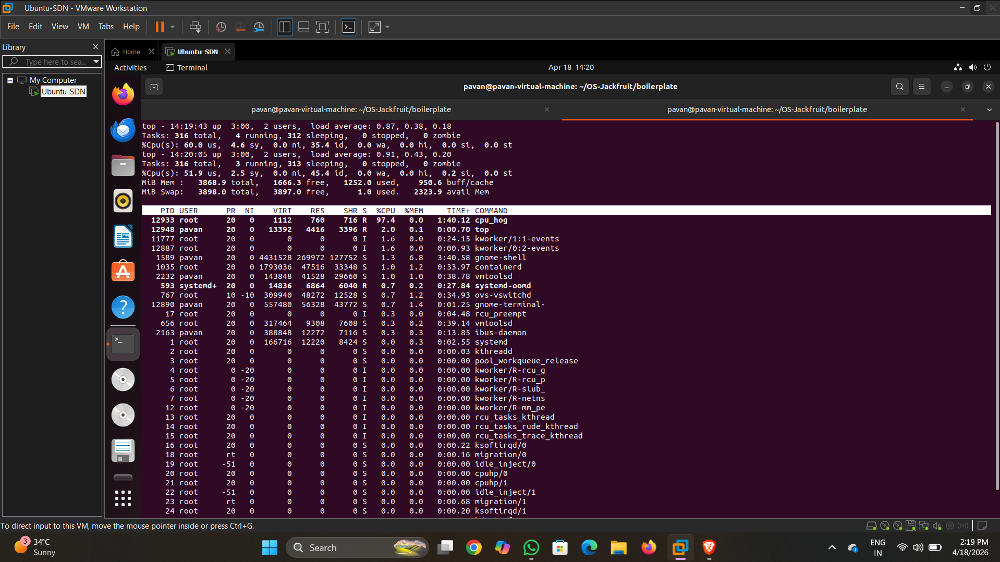
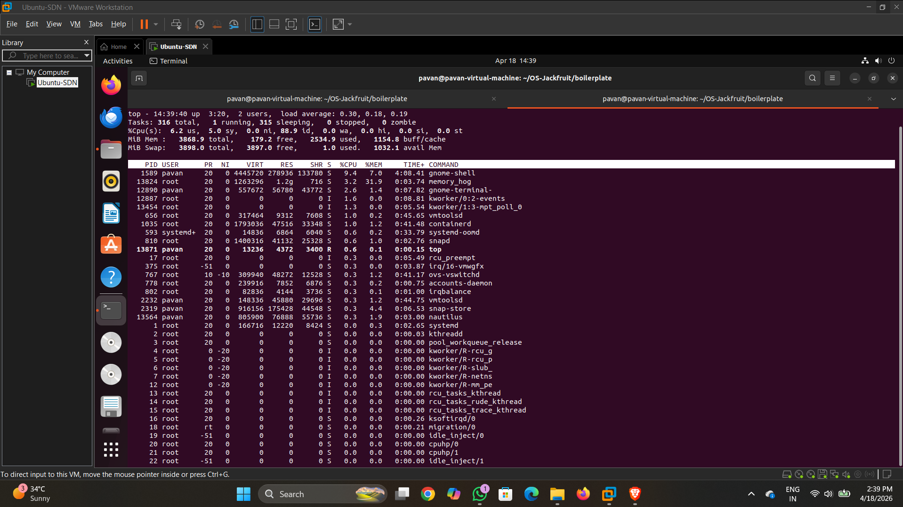
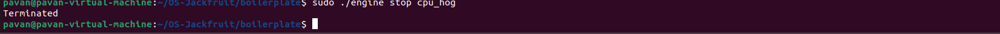

# Multi-Container Runtime (OS Mini Project)

## 📌 Overview

This project implements a lightweight container runtime in C that supports execution of isolated workloads using Linux system calls. It provides basic container lifecycle management including starting, stopping, and monitoring containers.

---

## 🧠 Objectives

* Build a container runtime using C
* Execute isolated workloads using `chroot()`
* Implement process lifecycle management (start, stop, monitor)
* Analyze CPU and memory utilization

---

## 🏗️ Architecture

### 1. User-Space Runtime (`engine.c`)

The core runtime responsible for:

* Creating containers using `fork()`
* Isolating filesystem using `chroot()`
* Executing workloads using `execvp()`
* Managing container lifecycle

### 2. Kernel Module (`monitor.c`)

* Basic kernel module for monitoring support
* Successfully builds and loads into kernel
* Device: `/dev/container_monitor`

### 3. Workloads

* `cpu_hog` → CPU-intensive infinite loop
* `memory_hog` → Incremental memory allocation
* `io_pulse` → I/O workload

---

## ⚙️ Setup

```bash
git clone https://github.com/<your-username>/OS-Jackfruit.git
cd OS-Jackfruit/boilerplate

sudo apt update
sudo apt install -y build-essential linux-headers-$(uname -r)

make
```

---

## 📂 Root Filesystem

```bash
mkdir rootfs-base
wget https://dl-cdn.alpinelinux.org/alpine/v3.20/releases/x86_64/alpine-minirootfs-3.20.3-x86_64.tar.gz
tar -xzf alpine-minirootfs-3.20.3-x86_64.tar.gz -C rootfs-base

cp -a rootfs-base rootfs-alpha
```

---

## 🚀 Container Commands

### 🔹 Run (Foreground)

```bash
sudo ./engine run alpha ../rootfs-alpha /cpu_hog
```

---

### 🔹 Start (Background)

```bash
sudo ./engine start alpha ../rootfs-alpha /cpu_hog
```

---

### 🔹 List Running Containers

```bash
sudo ./engine ps
```

---

### 🔹 Stop Container

```bash
sudo ./engine stop cpu_hog
```

---

## 🔥 CPU Workload Demo

```bash
sudo ./engine run alpha ../rootfs-alpha /cpu_hog
top
```

### Observation

* CPU usage reaches ~100%
* Demonstrates CPU-bound workload

---

## 🧠 Memory Workload Demo

```bash
sudo ./engine run alpha ../rootfs-alpha /memory_hog
top
```

### Observation

* Memory usage increases continuously
* Demonstrates memory pressure

---

## 📊 Features Implemented

* Container creation using `fork()`
* Filesystem isolation using `chroot()`
* Workload execution using `execvp()`
* Background container execution (`start`)
* Process monitoring (`ps`)
* Container termination (`stop`)
* CPU and memory workload analysis

---

## 📸 Screenshots (Attach)

* CPU usage (~100%)
* Memory usage increase
* Running container processes

---

## 🧪 Analysis

### CPU Workload

* Infinite loop without delay
* Maximizes CPU utilization

### Memory Workload

* Allocates memory in chunks
* Demonstrates increasing memory consumption

---

## ⚠️ Challenges Faced

* Fixing kernel module compilation errors
* Debugging low CPU utilization
* Ensuring correct execution inside container
* Managing process lifecycle

---

## ✅ Conclusion

This project successfully demonstrates a basic container runtime with lifecycle management and resource monitoring. It provides practical understanding of process isolation and system-level programming.

---

## 🎤 Viva Questions

**What is a container?**
A lightweight isolated environment sharing the host kernel.

**How is isolation achieved?**
Using `chroot()` and process separation via `fork()`.

**Why does cpu_hog use high CPU?**
It runs a tight infinite loop without delay.

**How do you monitor containers?**
Using `ps` and system tools like `top`.

---
## 📸 Screenshots & Explanation

### CPU Workload


The cpu_hog program uses full CPU continuously.

---

### Memory Workload


The memory_hog program increases memory usage over time.

---

### Process Monitoring


Shows running container using ps command.

---

### Stop Container


Stops the running container process.
## 👨‍💻 Author

Name: **Pavan**
Course: Operating Systems
Project: Multi-Container Runtime
